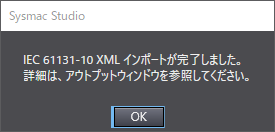
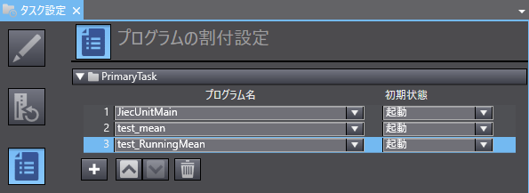
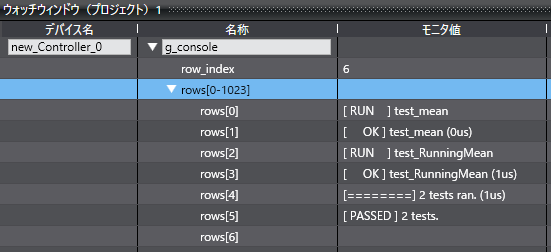
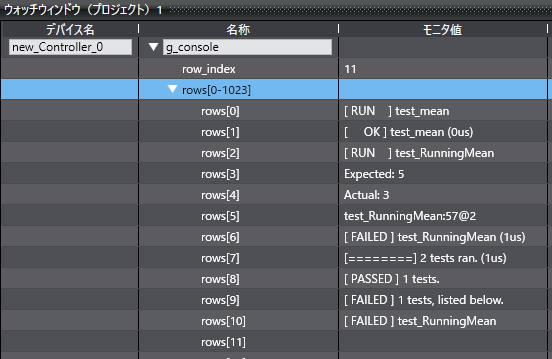

# JiecUnit

## 概要

JiecUnitは、テキスト形式で記述された[IEC 61131-3言語](https://plcopen.org/sites/default/files/downloads/iec_61131-3_preview.pdf)のPOUを単体テストするためのフレームワークです。

特徴は、テスト対象POUのソースコード、その単体テストコード、およびJiecUnit自体のソースコード含め全体がIEC 61131-3 ST言語を拡張したテキスト形式で完結していることです。このため、すべてがダイレクトにGit等で構成管理が可能です。

このテキスト形式のコードをPLCメーカーのツールで取り込み可能な形式に変換するために、[IEC 61131-3 ⇄ 10変換ソフトウェア Jiecc](https://www.graviness.com/iec_61131-3/jiecc.html)を使用します。JiecUnitは現在、[IEC 61131-10 XML](https://plcopen.org/sites/default/files/downloads/iec_61131-10_preview.pdf)をサポートするオムロン社製の[Sysmac Studio](https://www.fa.omron.co.jp/products/family/3077/download/software.html)のみを対象にしています。

## 必要環境

オムロン社製のSysmac Studioを使用して、JiecUnitフレームワーク上で動作するサンプルの単体テストを実行するための必要な環境は以下の通りです。

* [Jiecc 4.20以降](https://www.graviness.com/iec_61131-3/jiecc.html#Header.Jiecc%E3%81%AE%E3%83%80%E3%82%A6%E3%83%B3%E3%83%AD%E3%83%BC%E3%83%89%E3%81%A8%E5%AE%9F%E8%A1%8C%E6%96%B9%E6%B3%95): IEC 61131-3 ⇄ IEC 61131-10変換ソフトウェア
  * Jieccは、IEC 61131-3テキストをIEC 61131-10 XMLに変換するコマンドラインベースで無料のソフトウェアです。[Jieccのダウンロードと実行方法](https://www.graviness.com/iec_61131-3/jiecc.html#Header.Jiecc%E3%81%AE%E3%83%80%E3%82%A6%E3%83%B3%E3%83%AD%E3%83%BC%E3%83%89%E3%81%A8%E5%AE%9F%E8%A1%8C%E6%96%B9%E6%B3%95)から最新のJieccをダウンロードできます。
* [Sysmac Studio](https://www.fa.omron.co.jp/products/family/3077/download/software.html)
  * 高価なソフトウェアですが、Sysmac Studioに同梱されているシミュレータでテストが可能です。必要に応じて、PLC本体も入手してください。

## 単体テストのサンプルの実行方法

本プロジェクトには、JiecUnitを使って単体テストを実行可能なサンプルがあります。サンプルは、`samples`ディレクトリにあります。

`samples/sample_pous.txt`には、単体テスト対象として以下の2つのPOUが含まれます。
* `mean`ファンクション
  * 複数のデータを含む配列を入力とし、平均値を計算するファンクションです。
  * 1サイクルで実行するテストサンプルです。
* `RunningMean`ファンクションブロック
  * 各呼び出しにおける入力値ごとに状態を記憶し、その都度平均値を出力するFBです。
  * 複数サイクルに渡って実行するテストサンプルです。

`samples/sample.txt`には、上記2つのPOUをテストする2つのテストプログラム`test_mean`と`test_RunningMean`が含まれます。

テストサンプルの実行方法は次の通りです。

1. 次のコマンドを実行します。

`<JiecUnit Project Root>`は適宜プロジェクトをダウンロードしたディレクトリに変更してください。また、事前にjiecc.exeを`<JiecUnit Project Root>`直下におくか、jieccがあるディレクトリへパスを通しておいてください。

```
$ cd <JiecUnit Project Root>
$ jiecc .\samples\sample.txt -I. -I./sys -t omron -o .\samples\sample.xml
```

`.\samples\sample.xml`が出力されます。

2. 出力された`sample.xml`をSysmac StudioのIEC 61131-10インポート機能でインポートします（ツール|IEC 61131-10 XML|インポート）。

単体テストを実行するためのPOU群と、グローバル変数がインポートされます。インポート完了後に次のダイアログが表示されるので、OKを押下します。



3. Sysmac Studioのタスク設定でプライマリ定周期タスクに以下のようにプログラムを割り付けます（マルチビューエクスプローラ|構成・設定|タスク設定|プログラムの割付設定|）。`JiecUnitMain`が先頭になるように設定してください。
  * `JiecUnitMain`
  * `test_mean`
  * `test_RunningMean`



4. ビルドし、シミュレータ（F5キーで実行）や実機で実行します。
5. テストの実行結果がグローバル変数`g_console`に出力されます。



2つのテスト`test_mean`と`test_RunningMean`が実行され、テストをパス（成功）したことを意味します。

以下は、テストが失敗したときの例です。テスト`tset_RunningMean`のテストコード57行目の3サイクル目（@2）で失敗したことを意味します。


※*57行目*という数字は、XMLにコンバートする前のテキストの行番号です。これをSysmac Studio上のtest_RunningMeanの行数で表示するテクニックは、[Jieccソフトウェア](https://www.graviness.com/iec_61131-3/jiecc.html)の機能を活用します。ここでは、深く述べません。

## JiecUnit開発者向け

### リポジトリ構成

* `jiecunit.txt`
  * JiecUnitユーザが使用すべき公開APIを含みます。
* `docs`ディレクトリ
  * 補助的な資料を含みます。
* `samples`ディレクトリ
  * JiecUnitを試用するためのサンプルコードを含みます。
* `src`ディレクトリ
  * JiecUnitのソースコードを含みます。
* `sys`ディレクトリ
  * JiecUnitの実行に必要なsys的なコードを含みます。PLCメーカーにない型変換ファンクションや擬似的なコンソール出力用途のコードを含みます。
* `test`ディレクトリ
  * JiecUnit自体の単体テストコードを含みます。

### JiecUnitのテスト方法

TODO

```
$ cd <jiecunit project root>
$ mkdir check
$ cd check
$ jiecc -I.. -I../sys ../test/test_sys_conv.txt -o ./test_sys_conv.xml
```

## ライセンス

このプロジェクトはApache License 2.0の下でライセンスされています。詳細は[LICENSE](./LICENSE)ファイルを参照してください。

## その他の情報

[Graviness Blog](http://blog.graviness.com/)を参照ください。
