# JiecUnit

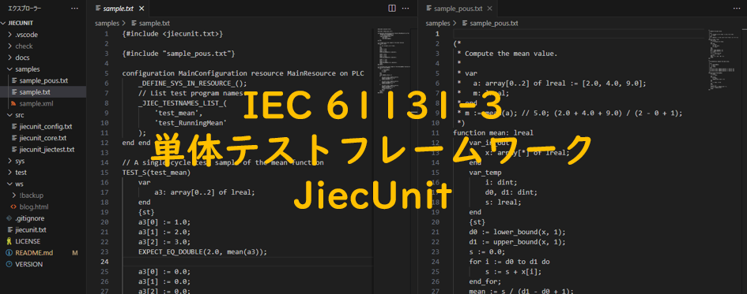

## 概要

JiecUnitは、テキスト形式で記述された[IEC 61131-3言語](https://plcopen.org/sites/default/files/downloads/iec_61131-3_preview.pdf)のPOUを単体テストするためのフレームワークです。

特徴は、テスト対象POUのソースコード、その単体テストコード、およびJiecUnit自体のソースコード含め全体がIEC 61131-3 ST言語を拡張したテキスト形式で完結していることです。このため、すべてがダイレクトにGit等で構成管理が可能です。使用するIDEによっては生成AIを使ってIEC 61131-3プログラミングできます。

このテキスト形式のコードをPLCメーカーのツールで取り込み可能な形式に変換するために、[IEC 61131-3 ⇄ IEC 61131-10変換ソフトウェア Jiecc](https://www.graviness.com/iec_61131-3/jiecc.html)を使用します。

JiecUnitは現在、[IEC 61131-10 XML](https://plcopen.org/sites/default/files/downloads/iec_61131-10_preview.pdf)をサポートするオムロン社製の[Sysmac Studio](https://www.fa.omron.co.jp/products/family/3077/download/software.html)とキーエンス社製の[KV Studio](https://www.keyence.co.jp/support/user/controls/installer/)のみをサポートしています。

## 必要環境

オムロン社製の[Sysmac Studio](https://www.fa.omron.co.jp/products/family/3077/download/software.html)、キーエンス社製の[KV Studio](https://www.keyence.co.jp/support/user/controls/installer/)、又はCODESYS社製の[CODESYS](https://content.helpme-codesys.com/en/CODESYS%20Installer/_inst_start_page.html)を使用して、JiecUnitフレームワーク上で動作するサンプルの単体テストを実行するための必要な環境は以下の通りです。

* [Jiecc 5.8以降](https://www.graviness.com/iec_61131-3/jiecc.html#Header.Jiecc%E3%81%AE%E3%83%80%E3%82%A6%E3%83%B3%E3%83%AD%E3%83%BC%E3%83%89%E3%81%A8%E5%AE%9F%E8%A1%8C%E6%96%B9%E6%B3%95)
  * Jieccは、IEC 61131-3テキストをIEC 61131-10 XMLに変換するコマンドラインベースで無料のソフトウェアです。[Jieccのダウンロードと実行方法](https://www.graviness.com/iec_61131-3/jiecc.html#Header.Jiecc%E3%81%AE%E3%83%80%E3%82%A6%E3%83%B3%E3%83%AD%E3%83%BC%E3%83%89%E3%81%A8%E5%AE%9F%E8%A1%8C%E6%96%B9%E6%B3%95)から最新のJieccをダウンロードできます。
* [Sysmac Studio](https://www.fa.omron.co.jp/products/family/3077/download/software.html)（試用期間制限あり） 又は [KV Studio](https://www.keyence.co.jp/support/user/controls/installer/)（試用回数制限あり） 又は [CODESYS](https://content.helpme-codesys.com/en/CODESYS%20Installer/_inst_start_page.html)
  * 同梱されているシミュレータでテストが可能です。必要に応じて、PLC本体も入手してください。

## 単体テストのサンプルの実行方法

まず、JiecUnitプロジェクトをダウンロードします。JiecUnit mainブランチの[Download ZIP](https://github.com/yunos0987/jiecunit/archive/refs/heads/main.zip)してzipファイルを適当なディレクトリに展開するか、`git clone https://github.com/yunos0987/jiecunit.git`などを実行してください。

JiecUnitプロジェクトには、JiecUnitを使って単体テストを実行可能なサンプルがあります。サンプルは、[samplesディレクトリ](./samples/)にあります。[samples/sample_pous.txt](./samples/sample_pous.txt)には、単体テスト対象として以下の2つのPOUが含まれます。
* `mean`ファンクション
  * 複数のデータを含む配列を入力とし、平均値を計算するファンクションです。
* `RunningMean`ファンクションブロック
  * 各呼び出しにおける入力値ごとに状態を記憶し、その都度平均値を出力するFBです。

[samples/sample.txt](./samples/sample.txt)には、上記2つのPOUをテストする2つのテストプログラム`test_mean`と`test_RunningMean`が含まれています。それぞれ、1サイクルで実行するテストサンプルと、複数サイクルに渡って実行するテストサンプルです。

テストサンプルの実行方法は次の通りです。環境別に説明します。

### オムロン社製Sysmac Studioの場合の単体テストサンプルの実行方法

1. コマンドプロンプトを起動し、次のコマンドを実行します。

コマンド内の`<JiecUnit Project Root>`はJiecUnitプロジェクトをダウンロードしたディレクトリに変更してください。また、事前にjiecc.exeを`<JiecUnit Project Root>`直下におくか、jieccがあるディレクトリへパスを通しておいてください。

```
$ cd <JiecUnit Project Root>
$ jiecc .\samples\sample.txt -I. -I.\sys -t omron -o .\samples\sample.xml
```

`.\samples\sample.xml`が出力されます。

2. 出力された`.\samples\sample.xml`をSysmac StudioのIEC 61131-10インポート機能 [ ツール | IEC 61131-10 XML | インポート ] でインポートします。

単体テストを実行するためのグローバル変数、データ型、およびPOUがインポートされます。インポート完了後に次のダイアログが表示されるので、OKを押下します。


3. Sysmac Studioのタスク設定でプライマリ定周期タスクに以下のようにプログラムを割り付けます（マルチビューエクスプローラ|構成・設定|タスク設定|プログラムの割付設定|）。必要に応じて、デフォルトで作成されるProgram0プログラムを削除してください。特に、`JiecUnitMain`が先頭になるように設定してください。
  * `JiecUnitMain`
  * `test_mean`
  * `test_RunningMean`


4. ビルド（F8キー）し、シミュレータ（F5キー）や実機で実行します。
5. テストの実行結果がグローバル変数`g_console`に出力されます。


2つのテスト`test_mean`と`test_RunningMean`が実行され、テストをパス（成功）したことを意味します。

以下は、テストが失敗したときの例です。テスト`tset_RunningMean`のテストコード57行目の3サイクル目（@2）において、期待値は5であったが、実値は3となり、失敗したことを意味します。

※*57行目*という数字は、XMLにコンバートする前のテキストの行番号です。これをSysmac Studio上のtest_RunningMeanの行数で表示するテクニックは、[Jieccソフトウェア](https://www.graviness.com/iec_61131-3/jiecc.html)の機能を活用します。ここでは、深く述べません。


### キーエンス社製KV Studioの場合の単体テストサンプルの実行方法

1. コマンドプロンプトを起動し、次のコマンドを実行します。

コマンド内の`<JiecUnit Project Root>`はJiecUnitプロジェクトをダウンロードしたディレクトリに変更してください。また、事前にjiecc.exeを`<JiecUnit Project Root>`直下におくか、jieccがあるディレクトリへパスを通しておいてください。

```
$ cd <JiecUnit Project Root>
$ jiecc .\samples\sample.txt -I. -I.\sys -t keyence -o .\samples\sample.xml
```

`.\samples\sample.xml`が出力されます。

2. 出力された`.\samples\sample.xml`をKV StudioのIEC 61131-10インポート機能 [ ファイル | インポート | IEC 61131-10 XMLのインポート ] でインポートします。

単体テストを実行するためのグローバル変数、データ型、およびPOUがインポートされます。インポート完了後に次のダイアログが表示されるので、OKを押下します。

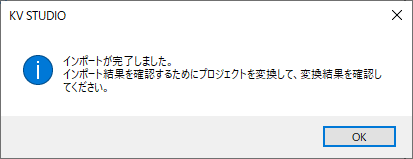

3. KV Studioのワークスペースにおいて、毎スキャンモジュールが次のようになっていることを確認します。必要に応じて、デフォルトで作成されるMainモジュールを削除してください。特に`JiecUnitMain`が先頭になっていることを確認してください。
  * `JiecUnitMain`
  * `test_mean`
  * `test_RunningMean`

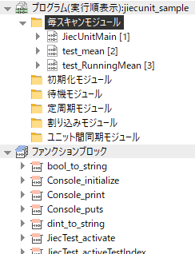

4. 変換（Ctrl＋F9キー）し、シミュレータ（Ctrl＋F2キー）や実機で実行（シミュレータの場合、[ デバッグ | RUN ]）します。
5. テストの実行結果がグローバル変数`g_console`に出力されます。

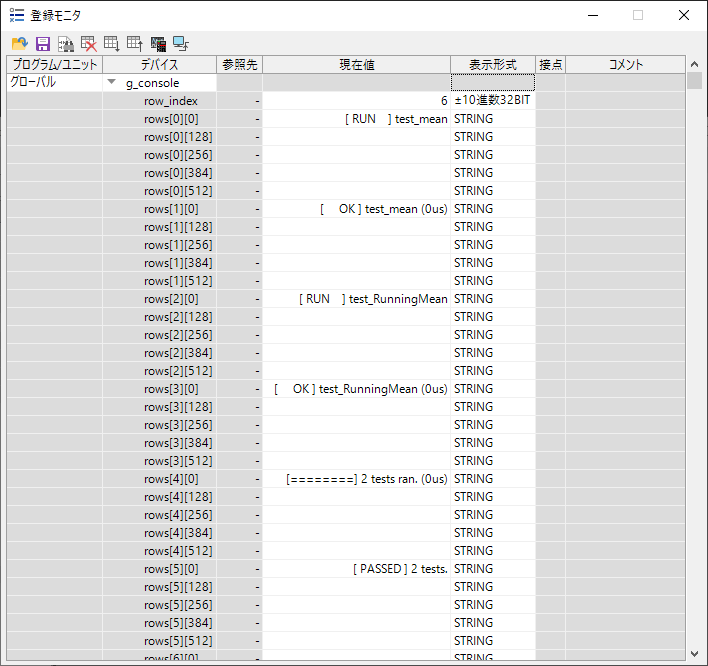

2つのテスト`test_mean`と`test_RunningMean`が実行され、テストをパス（成功）したことを意味します。

以下は、テストが失敗したときの例です。テスト`tset_RunningMean`のテストコード56行目の3サイクル目（@2）において、期待値は5であったが、実値は3となり、失敗したことを意味します。

※*56行目*という数字は、XMLにコンバートする前のテキストの行番号です。これをKV Studio上のtest_RunningMeanの行数で表示するテクニックは、[Jieccソフトウェア](https://www.graviness.com/iec_61131-3/jiecc.html)の機能を活用します。ここでは、深く述べません。

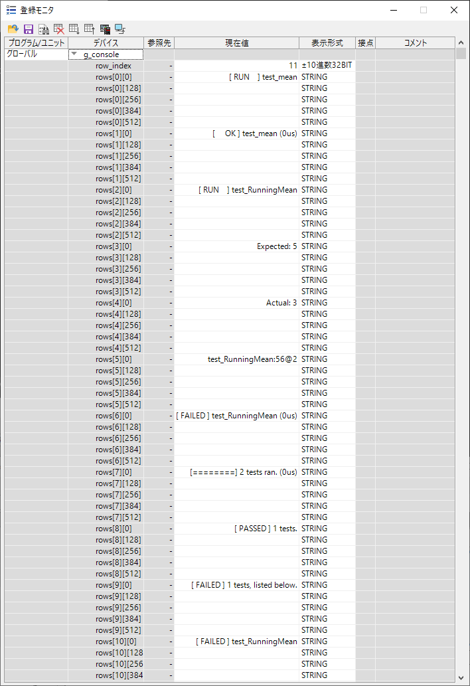

### CODESYS社製CODESYSの場合の単体テストサンプルの実行方法

事前にCODESYSの[IEC 61131-10のインポート機能を有効化](https://content.helpme-codesys.com/en/CODESYS%20Development%20System/_cds_cmd_import_iec_61131_10.html)しておいてください。

1. コマンドプロンプトを起動し、次のコマンドを実行します。

コマンド内の`<JiecUnit Project Root>`はJiecUnitプロジェクトをダウンロードしたディレクトリに変更してください。また、事前にjiecc.exeを`<JiecUnit Project Root>`直下におくか、jieccがあるディレクトリへパスを通しておいてください。

```
$ cd <JiecUnit Project Root>
$ jiecc .\samples\sample.txt -I. -I.\sys -t codesys -o .\samples\sample.xml
```

`.\samples\sample.xml`が出力されます。

2. CODESYSにてNew ProjectにてEmpty projectを作成し、出力された`.\samples\sample.xml`をCODESYSのIEC 61131-10インポート機能でインポートします。

インポートダイアログが表示されます。

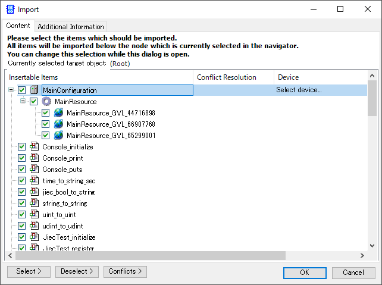

3. OKボタンを押下します。

単体テストを実行するためのコンフィグレーション、リソース、グローバル変数、データ型、POUがインポートされます。

4. CODESYSのDevices画面において、インポートされたMainConfigurationを右クリックし、Update Device...から適切なデバイスを設定します。

5. POUs画面において、以下画像の通りにオブジェクトを選択し、Devices画面のMainResourceにドラッグ＆ドロップします。

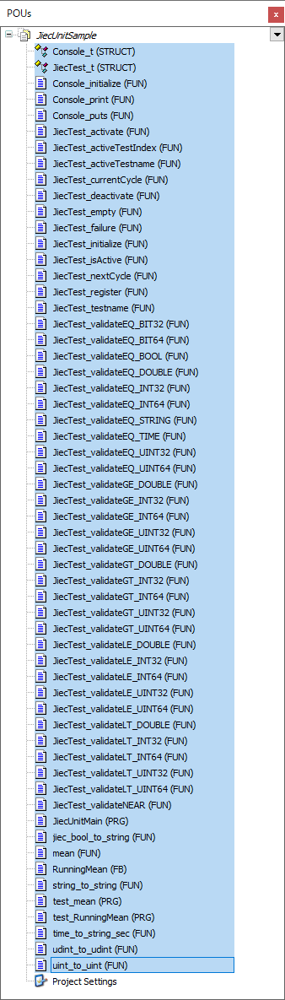

MainResouce下にオブジェクトが移動されます。

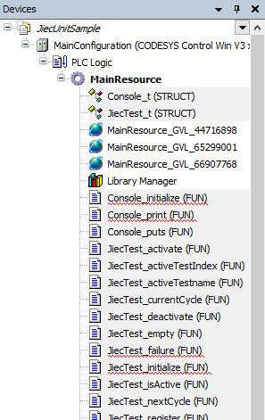

6. Devices画面において、MainResourceを右クリックし、Add Object | Add Task Configuration...し、追加されたTask Configurationを次のように設定します。特に`JiecUnitMain`が先頭になっていることを確認してください。
  * `JiecUnitMain`
  * `test_mean`
  * `test_RunningMean`

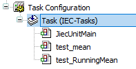

7. Devices画面のLibrary Managerを選択し、次の画面のようにし、OKボタンを押下します。

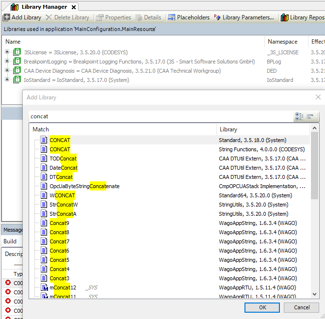

Standardライブラリが追加されます。

7. Generate Code（F11キー）すると、「C0174: VAR_TEMP declaration not allowwed in this place」エラーが複数出力されますので、Replaceダイアログで次のように設定し、Replace Allボタンを押下します。

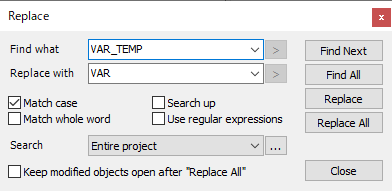

ソースコード内のすべての`VAR_TEMP`が`VAR`に置換されます。

8. Generate Code（F11キー）し、成功することを確認します。シミュレーションや実機で実行（シミュレーションの場合、[ Debug | F5 ]）します。

9. テストの実行結果がグローバル変数`g_console`に出力されます。

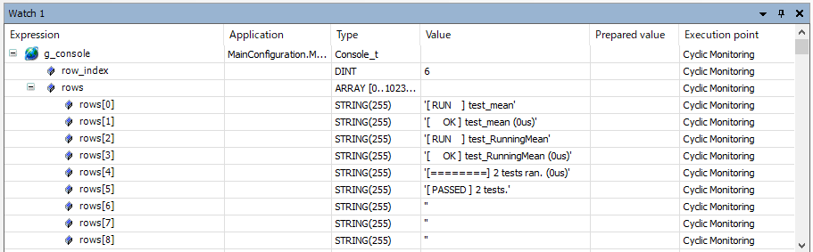

2つのテスト`test_mean`と`test_RunningMean`が実行され、テストをパス（成功）したことを意味します。

以下は、テストが失敗したときの例です。テスト`tset_RunningMean`のテストコード58行目の3サイクル目（@2）において、期待値は5.0であったが、実値は3.0となり、失敗したことを意味します。

※*58行目*という数字は、XMLにコンバートする前のテキストの行番号です。これをCODESYS上のtest_RunningMeanの行数で表示するテクニックは、[Jieccソフトウェア](https://www.graviness.com/iec_61131-3/jiecc.html)の機能を活用します。ここでは、深く述べません。

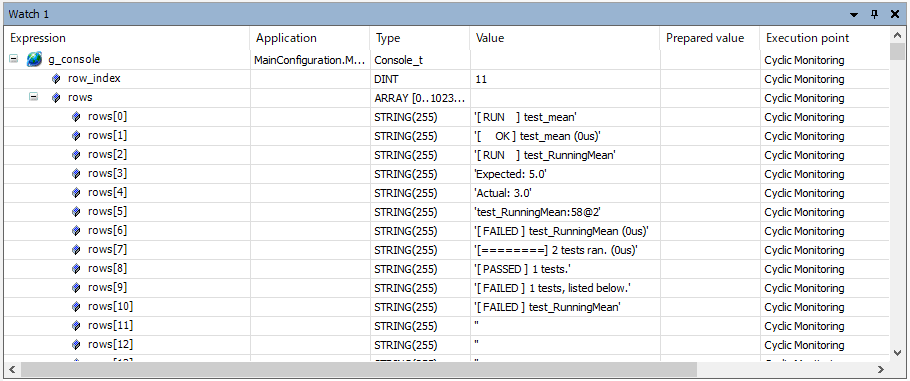

## JiecUnit開発者向け

### リポジトリ構成

* [jiecunit.txt](./jiecunit.txt)
  * JiecUnitユーザが使用すべき公開APIを含みます。
* [docsディレクトリ](./docs/)
  * 補助的な資料を含みます。
* [samplesディレクトリ](./samples/)
  * JiecUnitを試用するためのサンプルコードを含みます。
* [srcディレクトリ](./src/)
  * JiecUnitのソースコードを含みます。
* [sysディレクトリ](./sys/)
  * JiecUnitの実行に必要なsys的なコードを含みます。PLCメーカーにない型変換ファンクションや擬似的なコンソール出力用途のコードを含みます。
* [testディレクトリ](./test/)
  * JiecUnit自体の単体テストコードを含みます。

### JiecUnitのテスト方法

TODO

```
$ cd <JiecUnit Project Root>
$ mkdir check
$ cd check
$ jiecc -I.. -I..\sys ..\test\test.txt -o .\test.xml -t omron
or
$ jiecc -I.. -I..\sys ..\test\test.txt -o .\test.xml -t keyence
or
$ jiecc -I.. -I..\sys ..\test\test.txt -o .\test.xml -t codesys
```

## ライセンス

このプロジェクトはApache License 2.0の下でライセンスされています。詳細は[LICENSE](./LICENSE)ファイルを参照してください。

## その他の情報

[Graviness Blog](http://blog.graviness.com/?eid=949303)を参照ください。
