# JiecUnit

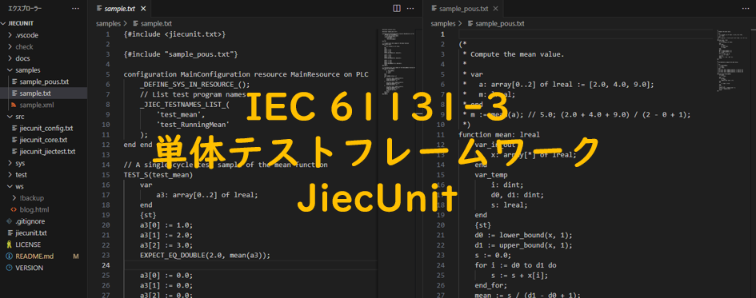

## 目次
- [概要](#概要)
- [必要環境](#必要環境)
- [単体テストのサンプルの実行方法](#単体テストのサンプルの実行方法)
  - [オムロン社製Sysmac Studioの場合](#オムロン社製sysmac-studioの場合の単体テストサンプルの実行方法)
  - [キーエンス社製KV Studioの場合](#キーエンス社製kv-studioの場合の単体テストサンプルの実行方法)
  - [CODESYS社製CODESYSの場合](#codesys社製codesysの場合の単体テストサンプルの実行方法)
- [JiecUnit開発者向け](#jiecunit開発者向け)
  - [リポジトリ構成](#リポジトリ構成)
  - [JiecUnitのテスト方法](#jiecunitのテスト方法)
  - [各メーカーの言語サポート状況](#各メーカーの言語サポート状況)
- [ライセンス](#ライセンス)
- [その他の情報](#その他の情報)

## 概要

JiecUnitは、テキスト形式で記述された[IEC 61131-3言語](https://plcopen.org/sites/default/files/downloads/iec_61131-3_preview.pdf)のPOUを単体テストするためのフレームワークです。

特徴は、テスト対象POUのソースコード、単体テストコード、JiecUnit自体のソースコードがすべてIEC 61131-3 ST言語を拡張したテキスト形式で完結している点です。これにより、Git等で直接構成管理が可能です。[Visual Studio Code](https://code.visualstudio.com/)などの対応IDEによっては生成AIを活用したIEC 61131-3プログラミングも可能です。

このテキスト形式コードをPLCメーカーのツールで取り込み可能な形式に変換するため、[IEC 61131-3 ⇄ IEC 61131-10変換ソフトウェア Jiecc](https://www.graviness.com/iec_61131-3/jiecc.html)を使用します。

JiecUnitは現在、[IEC 61131-10 XML](https://plcopen.org/sites/default/files/downloads/iec_61131-10_preview.pdf)をサポートする以下の環境に対応しています。
* オムロン社製[Sysmac Studio](https://www.fa.omron.co.jp/products/family/3077/download/software.html)
* キーエンス社製[KV Studio](https://www.keyence.co.jp/support/user/controls/installer/)
* CODESYS社製[CODESYS](https://content.helpme-codesys.com/en/CODESYS%20Installer/_inst_start_page.html)

## 必要環境

JiecUnitのサンプル単体テストを実行するには、以下の環境が必要です。

* [Jiecc 5.14以降](https://www.graviness.com/iec_61131-3/jiecc.html#Header.Jiecc%E3%81%AE%E3%83%80%E3%82%A6%E3%83%B3%E3%83%AD%E3%83%BC%E3%83%89%E3%81%A8%E5%AE%9F%E8%A1%8C%E6%96%B9%E6%B3%95)
  * Jieccは、IEC 61131-3テキストをIEC 61131-10 XMLに変換する無料のコマンドラインソフトウェアです。[Jieccのダウンロードと実行方法](https://www.graviness.com/iec_61131-3/jiecc.html#Header.Jiecc%E3%81%AE%E3%83%80%E3%82%A6%E3%83%B3%E3%83%AD%E3%83%BC%E3%83%89%E3%81%A8%E5%AE%9F%E8%A1%8C%E6%96%B9%E6%B3%95)を参照してください。
* [Sysmac Studio](https://www.fa.omron.co.jp/products/family/3077/download/software.html)（試用期間制限あり）、[KV Studio](https://www.keyence.co.jp/support/user/controls/installer/)（試用回数制限あり）、または[CODESYS](https://content.helpme-codesys.com/en/CODESYS%20Installer/_inst_start_page.html)
  * いずれも同梱シミュレータでテスト可能。必要に応じてPLC本体もご用意ください。

## 単体テストのサンプルの実行方法

まず、JiecUnitプロジェクトをダウンロードします。mainブランチの[Download ZIP](https://github.com/yunos0987/jiecunit/archive/refs/heads/main.zip)で取得するか、`git clone https://github.com/yunos0987/jiecunit.git`でクローンしてください。

JiecUnitプロジェクトには、単体テスト実行可能なサンプルが[samplesディレクトリ](./samples/)にあります。[samples/sample_pous.txt](./samples/sample_pous.txt)には、テスト対象POUとして以下2つが含まれます。
* `mean`ファンクション：配列入力の平均値を計算
* `RunningMean`ファンクションブロック：状態を記憶し逐次平均値を出力

[samples/sample.txt](./samples/sample.txt)には、上記POUをテストする2つのテストプログラム`test_mean`と`test_RunningMean`が含まれています。

テストサンプルの実行方法は環境ごとに異なります。

### オムロン社製Sysmac Studioの場合の単体テストサンプルの実行方法

1. コマンドプロンプトを起動し、次のコマンドを実行します。

コマンド内の`<JiecUnit Project Root>`はJiecUnitプロジェクトをダウンロードしたディレクトリに変更してください。また、事前にjiecc.exeを`<JiecUnit Project Root>`直下におくか、jieccがあるディレクトリへパスを通しておいてください。

```
$ cd <JiecUnit Project Root>
$ jiecc .\samples\sample.txt -I. -I.\sys -t omron -o .\samples\sample.xml
```

`.\samples\sample.xml`が出力されます。

2. 出力された`.\samples\sample.xml`をSysmac StudioのIEC 61131-10インポート機能 [ ツール | IEC 61131-10 XML | インポート ] でインポートします。

単体テストを実行するためのグローバル変数、データ型、およびPOUがインポートされます。インポート完了後に次のダイアログが表示されるので、OKを押下します。

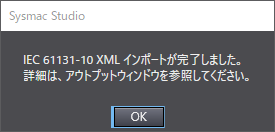

3. Sysmac Studioのタスク設定でプライマリ定周期タスクに以下のようにプログラムを割り付けます（マルチビューエクスプローラ|構成・設定|タスク設定|プログラムの割付設定|）。必要に応じて、デフォルトで作成されるProgram0プログラムを削除してください。特に、`JiecUnitMain`が先頭になるように設定してください。
  * `JiecUnitMain`
  * `test_mean`
  * `test_RunningMean`

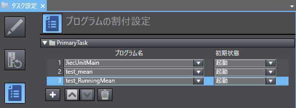

4. ビルド（F8キー）し、シミュレータ（F5キー）や実機で実行します。
5. テストの実行結果がグローバル変数`g_console`に出力されます。

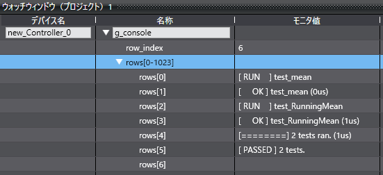

2つのテスト`test_mean`と`test_RunningMean`が実行され、テストをパス（成功）したことを意味します。

以下は、テストが失敗したときの例です。テスト`test_RunningMean`のテストコード57行目の3サイクル目（@2）において、期待値は5であったが、実値は3となり、失敗したことを意味します。

※*57行目*という数字は、XMLにコンバートする前のテキストの行番号です。これをSysmac Studio上のtest_RunningMeanの行数で表示するテクニックは、[Jieccソフトウェア](https://www.graviness.com/iec_61131-3/jiecc.html)の機能を活用します。ここでは、深く述べません。

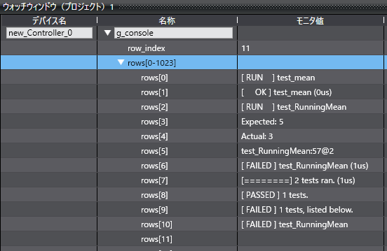

### キーエンス社製KV Studioの場合の単体テストサンプルの実行方法

1. コマンドプロンプトを起動し、次のコマンドを実行します。

コマンド内の`<JiecUnit Project Root>`はJiecUnitプロジェクトをダウンロードしたディレクトリに変更してください。また、事前にjiecc.exeを`<JiecUnit Project Root>`直下におくか、jieccがあるディレクトリへパスを通しておいてください。

```
$ cd <JiecUnit Project Root>
$ jiecc .\samples\sample.txt -I. -I.\sys -t keyence -o .\samples\sample.xml
```

`.\samples\sample.xml`が出力されます。

2. 出力された`.\samples\sample.xml`をKV StudioのIEC 61131-10インポート機能 \[ ファイル | インポート | IEC 61131-10 XMLのインポート \] でインポートします。

単体テストを実行するためのグローバル変数、データ型、およびPOUがインポートされます。インポート完了後に次のダイアログが表示されるので、OKを押下します。

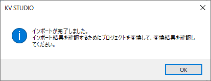

3. KV Studioのワークスペースにおいて、毎スキャンモジュールが次のようになっていることを確認します。必要に応じて、デフォルトで作成される`Main`モジュールを削除してください。特に`JiecUnitMain`が先頭になっていることを確認してください。
  * `JiecUnitMain`
  * `test_mean`
  * `test_RunningMean`

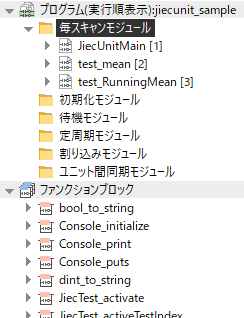

4. 変換（Ctrl＋F9キー）し、シミュレータ（Ctrl＋F2キー）や実機で実行（シミュレータの場合、[ デバッグ | RUN ]）します。
5. テストの実行結果がグローバル変数`g_console`に出力されます。

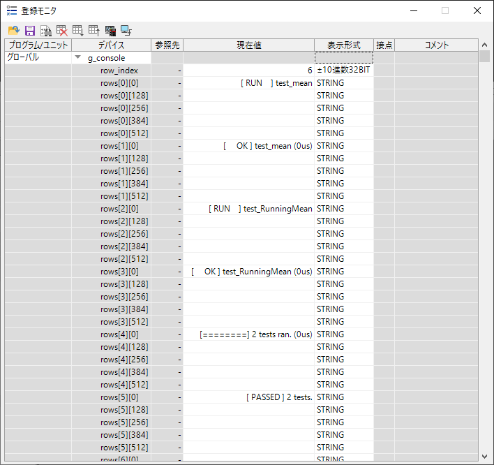

2つのテスト`test_mean`と`test_RunningMean`が実行され、テストをパス（成功）したことを意味します。

以下は、テストが失敗したときの例です。テスト`test_RunningMean`のテストコード56行目の3サイクル目（@2）において、期待値は5であったが、実値は3となり、失敗したことを意味します。

※*56行目*という数字は、XMLにコンバートする前のテキストの行番号です。これをKV Studio上のtest_RunningMeanの行数で表示するテクニックは、[Jieccソフトウェア](https://www.graviness.com/iec_61131-3/jiecc.html)の機能を活用します。ここでは、深く述べません。

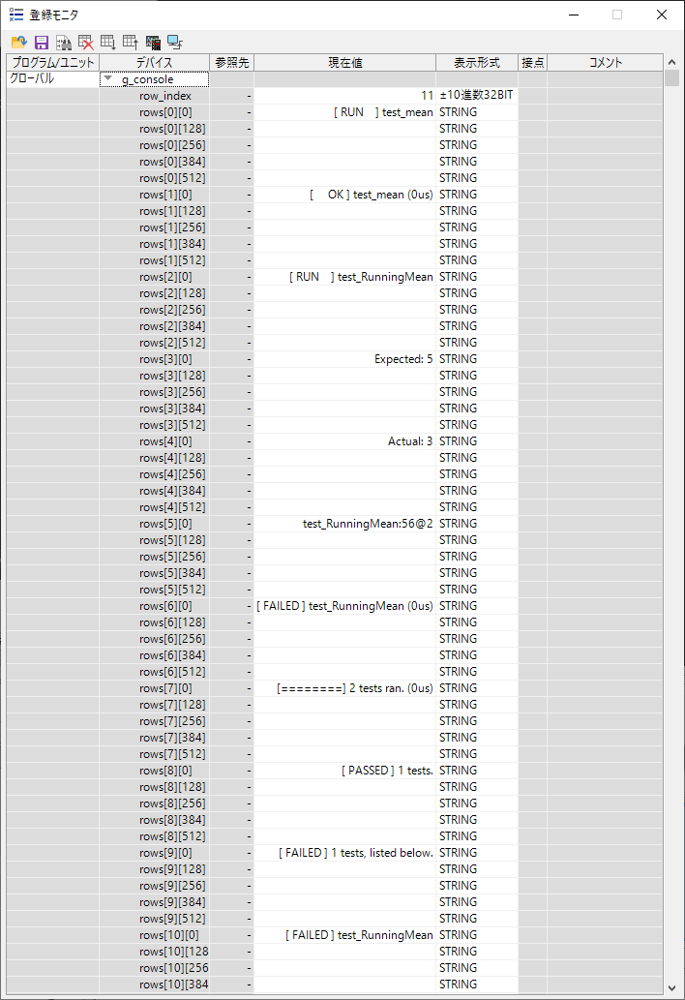

### CODESYS社製CODESYSの場合の単体テストサンプルの実行方法

事前にCODESYSの[IEC 61131-10のインポート機能を有効化](https://content.helpme-codesys.com/en/CODESYS%20Development%20System/_cds_cmd_import_iec_61131_10.html)しておいてください。

1. コマンドプロンプトを起動し、次のコマンドを実行します。

コマンド内の`<JiecUnit Project Root>`はJiecUnitプロジェクトをダウンロードしたディレクトリに変更してください。また、事前にjiecc.exeを`<JiecUnit Project Root>`直下におくか、jieccがあるディレクトリへパスを通しておいてください。

```
$ cd <JiecUnit Project Root>
$ jiecc .\samples\sample.txt -I. -I.\sys -t codesys -o .\samples\sample.xml
```

`.\samples\sample.xml`が出力されます。

2. CODESYSにてNew ProjectにてEmpty projectを作成し、出力された`.\samples\sample.xml`をCODESYSのIEC 61131-10インポート機能 \[File | Import IEC 61131-10\] でインポートします。

インポートダイアログが表示されます。

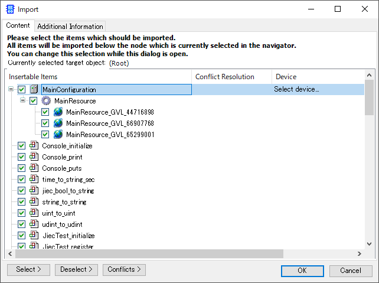

3. OKボタンを押下します。

単体テストを実行するためのコンフィグレーション、リソース、グローバル変数、データ型、POUがインポートされます。

4. CODESYSのDevices画面において、インポートされたMainConfigurationを右クリックし、Update Device...から適切なデバイスを設定します。

5. POUs画面において、以下画像の通りにオブジェクトを選択し（Project Settings以外を選択し）、Devices画面のMainResourceにドラッグ＆ドロップします。

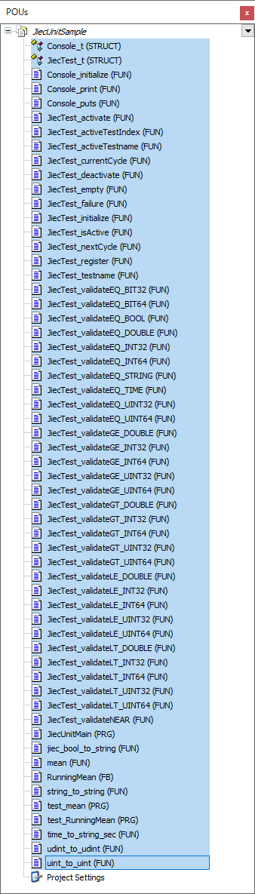

MainResouce下にオブジェクトが移動されます。

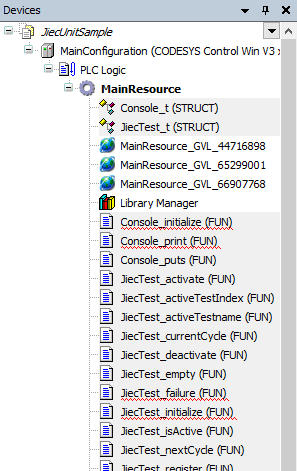

6. Devices画面において、MainResourceを右クリックし、Add Object | Task Configuration... し、追加されたTask Configurationを次のように設定します。特に`JiecUnitMain`が先頭になっていることを確認してください。
  * `JiecUnitMain`
  * `test_mean`
  * `test_RunningMean`

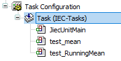

7. Devices画面のLibrary Managerを選択し、AddLibraryを選択し、次の画面のようにStandard Libraryの`CONCAT`を選択した状態にし、OKボタンを押下します。

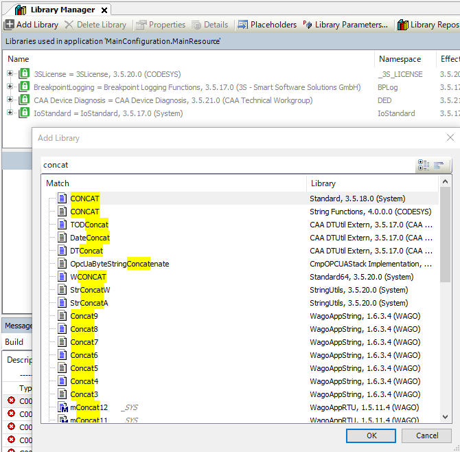

Standardライブラリが追加されます。

8. Generate Code（F11キー）すると、「C0174: VAR_TEMP declaration not allowed in this place」エラーが複数出力されますので、Replaceダイアログで次のように設定し、Replace Allボタンを押下します。

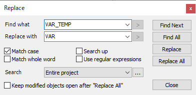

ソースコード内のすべての`VAR_TEMP`が`VAR`に置換されます。

9. Generate Code（F11キー）し、成功することを確認します。シミュレーションや実機で実行（シミュレーションの場合、[ Debug | F5 ]）します。

10. テストの実行結果がグローバル変数`g_console`に出力されます。

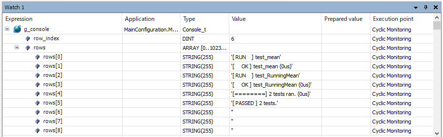

2つのテスト`test_mean`と`test_RunningMean`が実行され、テストをパス（成功）したことを意味します。

以下は、テストが失敗したときの例です。テスト`test_RunningMean`のテストコード58行目の3サイクル目（@2）において、期待値は5.0であったが、実値は3.0となり、失敗したことを意味します。

※*58行目*という数字は、XMLにコンバートする前のテキストの行番号です。これをCODESYS上のtest_RunningMeanの行数で表示するテクニックは、[Jieccソフトウェア](https://www.graviness.com/iec_61131-3/jiecc.html)の機能を活用します。ここでは、深く述べません。

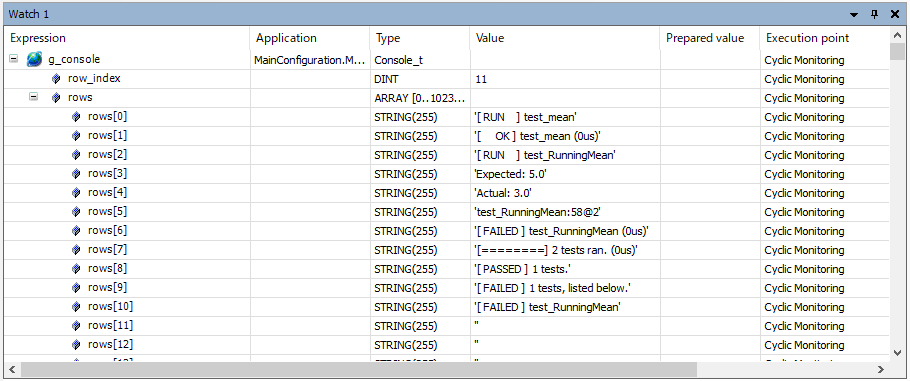

## JiecUnit開発者向け

### リポジトリ構成

* [jiecunit.txt](./jiecunit.txt)：JiecUnitユーザが使用すべき公開API。テスト記述用のマクロや関数群を定義。
* [docsディレクトリ](./docs/)：補助資料（各種画像、説明図、メーカー別手順、技術資料など）を格納。
* [samplesディレクトリ](./samples/)：JiecUnitの使い方サンプル。テスト対象POU（sample_pous.txt）とテストコード（sample.txt）を含む。
* [srcディレクトリ](./src/)：JiecUnit本体のソースコード。コア機能、テスト実行エンジン、設定ファイルなど。
* [sysディレクトリ](./sys/)：JiecUnitの動作に必要な補助的コード。型変換ファンクション、コンソール出力、メーカー依存の補助関数など。
* [testディレクトリ](./test/)：JiecUnit自体の単体テストコード。各種マクロ・内部関数の動作検証用テストファイル（test_jiectest.txt等）を含む。
* [README.md](./README.md)：本ドキュメント。使い方・構成・サポート状況などを記載。
* [LICENSE](./LICENSE)：ライセンス情報。
* [VERSION](./VERSION)：バージョン管理用ファイル。
* [VERSION_MANAGEMENT.md](./VERSION_MANAGEMENT.md)：バージョン管理の運用ルールや履歴。

### JiecUnitのテスト方法

ターゲットの環境ごとに以下のコマンドを実行し、上述と同じ手順を実行します。

```
$ cd <JiecUnit Project Root>
$ mkdir check
$ cd check
$ jiecc -I.. -I..\sys ..\test\test.txt -o .\test.xml -t omron
or
$ jiecc -I.. -I..\sys ..\test\test.txt -o .\test.xml -t keyence
or
$ jiecc -I.. -I..\sys ..\test\test.txt -o .\test.xml -t codesys
```

### 各メーカーのIEC 61131-3言語サポート状況

| 項目             | OM (Sysmac) | KE (KV) | CO (CODESYS) |
|------------------|:-----------:|:-------:|:------------:|
| データ型 SINT    | ✓           |         | ✓            |
| データ型 INT     | ✓           | ✓       | ✓            |
| データ型 DINT    | ✓           | ✓       | ✓            |
| データ型 LINT    | ✓           |         | ✓            |
| データ型 USINT   | ✓           |         | ✓            |
| データ型 UINT    | ✓           | ✓       | ✓            |
| データ型 UDINT   | ✓           | ✓       | ✓            |
| データ型 ULINT   | ✓           |         | ✓            |
| データ型 REAL    | ✓           | ✓       | ✓            |
| データ型 LREAL   | ✓           | ✓       | ✓            |
| データ型 BYTE    | ✓           |         | ✓            |
| データ型 WORD    | ✓           |         | ✓            |
| データ型 DWORD   | ✓           |         | ✓            |
| データ型 LWORD   | ✓           |         | ✓            |
| データ型 TIME    | ✓           |         | ✓            |
| データ型 BOOL    | ✓           | ✓       | ✓            |
| データ型 DATE    | ✓           |         | ✓            |
| データ型 TIME_OF_DAY    | ✓           |         | ✓            |
| データ型 DATE_AND_TIME    | ✓           |         | ✓            |
| データ型 STRING  | ✓           | ✓       | ✓            |
| データ型 WSTRING |             |         | ✓            |
| 構造体          | ✓           | ✓       | ✓            |
| FB              | ✓           | ✓       | ✓            |
| 配列            | ✓           | ✓       | ✓            |

## ライセンス

このプロジェクトはMIT Licenseのもとで公開されています。詳細は[LICENSE](./LICENSE)ファイルをご参照ください。

## その他の情報

[Graviness Blog](http://blog.graviness.com/?eid=949303)もご参照ください。
